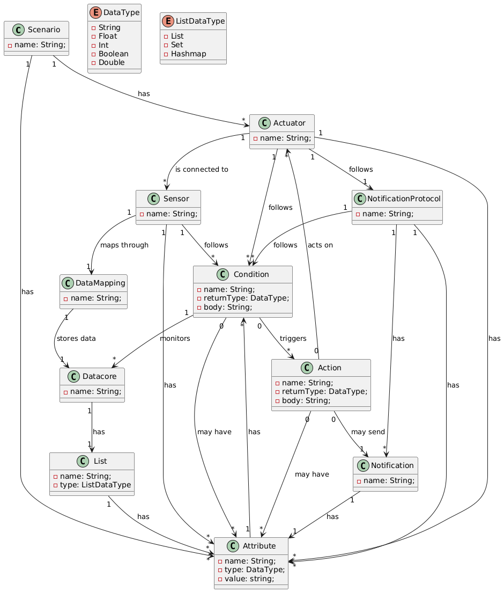

# ENORM Project, Part 1 - Team Report

This ReadMe will accomodate all specifications and development regarding the Part 1 of the project

**Note:** If for some reason you need to bypass these guidelines please ask for directions with your teacher and **always** state the exceptions in your commits and issues in bitbucket.

[TOC]

## Existing Domain Knowledge

This topic will abroad the information in the document as well as the development of the Domain Model and each scenario.

### Gathered Knowledge

The document given for the Part 1 of the ENORM project informs about a company which is expanding its business areas.

Right now, it supplies hardware and software solutions for industrial environments.

- *Hardware*:
  -- official partner and reseller of a company which produces industrial devices for many processes.

- *Software*:
  -- "Domain Specific Modeling Language for Cyber Physical Systems";
  -- "An Internet of Things visual domain specific modeling language based on UML";
  -- "LWiSSy: A domain specific language to model wireless sensor and actuators network systems";
  -- "SmartHomeML: Towards a Domain-Specific Modeling Language for Creating Smart Home Applications";

*Objective*: adopt a Domain-Specific Language (DSL) approach to:
- reading data from services;
- applying some logic to the received data;
- act on the devices;

*DSL Specifications*:
    - automating the development of software services by:
        -- supporting the scenario description;
        -- allowing the specification of the software service;
    - compliance with one standard communication protocole.g. MQTT, XMPP, DDS, CoAP);
    - textual and graphical syntaxes should be explored;
    - the DSL should generate code (e.g., Java, C++) - the intended software service - that, when executed, manages the specified scenario;

*Project goal*: produce DSL called DoSS. By the end of it, the scenario should be running by executing the code generated by the DSL.

*DSL status*: strong but powerful, supporting:
    - addition of multiple devices to the same scenario;
    - specifications of the device interfaces by its commands;
    - specification of a core data structure with conditions;
    - updating values of the attributes;
    - specification of the conditions;
    - actions specifications;

*DSL flexibility*: flexible and extensible, by:
    - supporting new devices;
    - supporting new and more complex conditions;
    - being able to decompose 1 scenario in sub-scenarios;


### Domain Model

This section will be developed in 3 parts, 1 for each scenario:
    - Conveyor Belt;
    - Waste Deposit;
    - Humidity Sensitive Area;

These 3 scenarios were mentioned in the previous chapter and therefore, each scenario will include the summarized information.

All the scenarios follow a common rule: one object has an unique ID in comparison to other instances. Besides that, there is some information which will be shown across all scenarios:

- Device
  - description: string;
  - turnedOn: boolean;
  - listSignals: List<Signal>;
  - frequency: integer;
  - 2 commands:
    - readSignal();
    - shouldBeTurnedOn() => gets the latest 3 signals (size-1, size-2 e size-3);

- Signal
  - valueRead: 0<=valueRead<=1;

#### Domain Model for **Conveyor Belt** - Pedro Alves

- 2 devices:
  - entryDevice: Device;
  - exitDevice: Device;

- 2 states:
  - stopped;
  - in motion;

- many commands: 
  - start();
  - stop();
  - checkSignals(String idDevice, String valueRead):
    if(state==stopped) {
      if(device.getLast3Signals(){
        start();
      } 
    }
  - checkPeriod(){  
     if (timeTurnedOn + warningPeriod > maxPeriod) => sendWarning();     
        if (minimumPeriod < timeTurnedOn)
           if (timeTurnedOn > maxPeriod) => stop()
     }
  - sendWarning(){
      emailMessageForWarning...
  }
- 1 timeTurnedOn;
- 1 maxPeriod:
  - integer;
- 1 warningPeriod:
  - integer;
- 1 minimumPeriod: 
  - integer;
- 1 stoppedPeriod: 
  - integer;


- Constrains
  - Signal values ranges from 0 to 1
  - If 3 straight signals are above 0 it starts
  - The default Value is stop
  - There are 2 notifications
    - One to warn
    - One to stop 

#### Domain Model for **Waste Deposit** - Pedro Coelho
- Monitoring Devices (3 units)
  - monitor1: Device;
  - monitor2: Device;
  - monitor3: Device;


- Light Device 
  - lightDevice: Device;
    - 3 possible states
      - green
      - yellow
      - red
      - Commands:
        - Turn on
        - Turn off
        - setColor(String color)


- Horn Device
  - hornDevice: Device;
    - Commands:
      - Turn on
      - Turn off

- Processes
  - normalize (String idDevice, String valueRead): return normalizedValue;
  - detectOutlier(String idDevice, String currentValue, String previousValue): if (abs(currentValue - previousValue) > threshold) return true; 
  - computeAverage(): return averageValueOfLast3Seconds(); 
  - updateLightDevice();
  - activateHorn(): hornDevice.turnOn();
  - deactivateHorn(): hornDevice.turnOff();

- Thresholds
  - warningThreshold: float;
  - dangerThreshold: float;
  - threshold: float;


- Constrains:
  - Given the 3 thresholds
    - warningThreshold
    - dangerThreshold
    - outlierThresholds
  - The received values are normalized if needed
  - Based on the received values, if the absolute difference between the current value and the last read is higher than the outlierThreshold the value is discarded)
  - The warning and danger thresholds are defined based on the capacity of the deposit
  - The LightDevice changes color based on the values read
  - The hornDevice is Activated/Deactivated based on the values read


- PlantUML Code for Domain Model - [WasteDeposit.puml](WasteDeposit.puml)

#### Domain Model for Humidity Sensitive Area - Miguel Carvalho

# Humidity Control System

## Domain Model

### Devices
- **humiditySensor**: `HumiditySensor`

### Actuators
- **dehumidifier**: `Dehumidifier`
- **waterVaporizer**: `WaterVaporizer`

### States
- `normal`
- `out of range`

## Commands

### checkHumidity()
```pseudo
if (filteredReading < minInnerLimit or filteredReading > maxInnerLimit) {
    activateActuator();
    sendNotification();
}
```

### filterOutliers()
```pseudo
if (abs(currentReading - previousAverage) > threshold) {
    discardReading();
}
```

### calculateAverage()
```pseudo
average the last 5 readings;
```

### activateActuator()
```pseudo
if (filteredReading < minOuterLimit) {
    waterVaporizer.turnOn();
} else if (filteredReading > maxOuterLimit) {
    dehumidifier.turnOn();
}
```

### sendNotification()
```pseudo
notificationService.sendSMS("Humidity out of range!");
```

## Parameters

### threshold
- Type: `float`

### minInnerLimit
- Type: `float`

### maxInnerLimit
- Type: `float`

### minOuterLimit
- Type: `float`

### maxOuterLimit
- Type: `float`

## Constraints
- Humidity values considered outliers are ignored
- Humidity is determined by averaging the last 5 seconds of readings
- Inner limits define a range where no action is taken
- Outer limits define when actuators are activated
- Notifications are sent when actuators are activated


## Design of the Domain Metamodel

We aim to build a general Device Management System, an interface to collect data from sensors and control device behavior through actuators.

We also aim to support multiple use-case scenarios through a flexible structure that aggregates behaviors, conditions, and notification protocols.

Sensors and Actuators remain central components in the metamodel.

### Overall Structure

The following classes define the reusable structure of the system and support our main elements:

- Action: operations that actuators can perform, such as turning on, stopping, or sending a notification.

- Condition: logical rules that determine when actions should be executed or when data should be monitored.

- Attribute: a characteristic or property of any element, defined with a specific data type.

- List: a dedicated data structure used by Datacore to store collections of attributes or sensor values, with a specified list type (e.g., List, Set, Hashmap).

- Scenario: a structural unit that groups actuators and attributes to represent a specific operational context (e.g., Waste Management, Humidity Control).

### Main Classes

The core classes that enable scenario behavior are:

- Actuator: a controllable device that can execute actions based on conditions, such as a Conveyor Belt or Waste Valve.

- Sensor: a component responsible for collecting data from the environment, linked to a data storage system.

- NotificationProtocol: defines how notifications are sent in response to conditions being met.

- Notification: a message that is transmitted to external systems or users.

- Datacore: a structured data repository used to store sensor readings, accessible via a DataMapping.

- DataMapping: defines the connection between a sensor and the Datacore.

### Main Relations

- All relationships in the metamodel define the operational logic between devices (such as sensors/actuators), data, and automation rules (conditions/actions):

- A Scenario includes multiple Actuators and Attributes that define its behavior and context.

- Each Actuator:

  - Is connected to one or more Sensors.

  - Follows multiple Conditions.

  - Uses one NotificationProtocol to manage messages.

  - Has multiple Attributes.

- Each Sensor:

  - Has multiple Attributes.

  - Follows multiple Conditions.

  - Is linked to a DataMapping that connects it to a Datacore.

- Each DataMapping connects to one Datacore, which:

  - Stores data in a single List.

- Each NotificationProtocol:

  - Contains multiple Notifications.

  - Has multiple Attributes.

  - Follows multiple Conditions.

- Each Notification:

  - Each Condition:

  - Can trigger multiple Actions.

  - Monitors one or more Datacores.

  - May include several Attributes.

- Each Action:

  - May act on one or more Actuators.

  - May send one Notification.

  - May include several Attributes.

- Attributes and Conditions can refer to one another.

- Action, Condition, and Attribute use DataType to define types (e.g., String, Boolean).

- List uses ListDataType (e.g., List, Set, Hashmap) and contains multiple Attributes.


## Metamodel Constraints and Refactorings

This section defines formal constraints derived from the analysis of the three domain-specific scenarios: **Conveyor Belt**, **Waste Deposit**, and **Humidity Sensitive Area**. These constraints aim to ensure correctness, consistency, and domain validity. When applicable, we propose refactorings to improve the metamodel based on those constraints.

---

### Constraints

Below are formalized constraints using pseudo-code and OCL-like notation, grouped by scenario:


- **C1 - Minimum motion time: (Scenario 1)**
  - The Actuator representing the conveyor belt should not be stopped before a minimum time.
  - This can be expressed as a Condition related to the Actuator with an Attribute tracking timeSinceStart.
     ```ocl
       context Actuator
       inv MinMotionTime:
       self.name = 'ConveyorBelt' implies
       self.conditions->exists(c | c.name = 'MinMotionTimeCondition' and
       c.body includes 'timeSinceStart >= 60' and
       -- logic checking no stop command issued before min time
       )
    ```


- **C2 - Object presence detection after 3 consecutive readings: (Scenario 1)**
  - The Sensor connected to the conveyor belt detects objects.
  - The threshold and consecutive readings logic can be encapsulated in Conditions on the Sensor.
  
    ```ocl
      context Sensor
      inv ObjectPresence:
      self.conditions->exists(c | c.name = 'ObjectPresenceCondition' and
      c.body includes '3 consecutive readings above threshold'
      )
    ```
  
  - **C3. Max motion time limit triggers stop: (Scenario 1)**

    - An Action on the Actuator (belt) triggers the stop command.

    - This should be linked to a Condition that monitors the time and triggers the stop Action.

      ```ocl
      context Condition
      inv MaxMotionTime:
      self.name = 'MaxMotionTimeCondition' implies
      self.triggers->exists(a | a.name = 'StopBeltAction' and
      a.actsOn->includes(Actuator.allInstances()->select(a|a.name='ConveyorBelt'))
      )
      ```


- **C4. Normalize sensor readings: (Scenario 2)**
  - DataMapping for each Sensor implements normalization logic.
  
      ``` ocl
      context DataMapping
      inv Normalization:
      self.name = 'NormalizationMapping' implies
      self.stores.dataType = DataType::Float and
      self.name includes 'value / scaleFactor'
      ```

- **C5. Outlier detection: (Scenario 2)**
  - Condition on Sensor to ignore readings where difference exceeds threshold.


```ocl
context Condition
inv OutlierDetection:
  self.name = 'OutlierDetectionCondition' implies
    self.body includes 'abs(currentValue - previousValue) <= threshold'
```

- **C6. Light and horn commands based on waste level(Scenario 2)**
  - Actuator instances for Light and Horn

  - Conditions determine which Actions (e.g., turn on red light or horn) are triggered.

``` ocl
context Scenario
inv LightHornControl:
  self.actuators->select(a | a.name = 'Light' or a.name = 'Horn')->forAll(a |
    a.conditions->exists(c |
      (c.body includes 'avgLevel >= dangerThreshold' implies
        c.triggers->exists(act | act.name = 'TurnOnRedLight' or act.name = 'TurnOnHorn')
      )
    )
  )
```

- **C7. No actuator activation within inner humidity limits(Scenario 3)**

```ocl
context Condition
inv InnerLimits:
  self.name = 'HumidityInnerLimitCondition' implies
    self.body includes 'avgHumidity >= innerMin and avgHumidity <= innerMax' and
    self.triggers->isEmpty()
```

- **C8. No actuator activation within inner humidity limits(Scenario 3)**

```ocl
context Condition
inv OuterLimits:
  self.name = 'HumidityOuterLimitCondition' implies
    (self.body includes 'avgHumidity < outerMin' and
     self.triggers->exists(a | a.actsOn->exists(actuator | actuator.name = 'WaterVaporizer'))
    ) or
    (self.body includes 'avgHumidity > outerMax' and
     self.triggers->exists(a | a.actsOn->exists(actuator | actuator.name = 'Dehumidifier'))
    )
```

- **C9. Humidity reading outlier filtering(Scenario 3)**

```ocl
context Condition
inv HumidityOutlierFiltering:
  self.name = 'HumidityOutlierFilterCondition' implies
    self.body includes 'abs(value - previousValue) <= humidityOutlierThreshold'
```

- **C10. SMS notification sent when actuator is activated**
  - Action that sends Notification linked to NotificationProtocol

```ocl
context Action
inv SMSNotification:
  self.name = 'SendSMSNotificationAction' implies
    self.maySend->exists(n | n.name = 'SMSNotification') and
    self.actsOn->exists(a | a.state = 'on')
```

---

### Refactorings

Refactor Texts
R1 - Simplify MinMotionTimeCondition logic:
Refactor the 'MinMotionTimeCondition' to use a global time variable instead of calculating timeSinceStart repeatedly.

R2 - Consolidate repeated sensor condition checks:
Group similar conditions on sensors to avoid duplication, by using threshold lists and loops inside the condition body.

R3 - Extract notification attributes into reusable component:
Create a 'NotificationAttribute' entity reusable across multiple notifications to reduce redundancy.

R4 - Move normalization logic from DataMapping to separate Action:
Isolate data normalization into a dedicated Action that can be reused in different DataMappings.

R5 - Unify outlier detection conditions with a global threshold parameter:
Use a global outlierThreshold parameter for all outlier detection conditions instead of hardcoded values.

R6 - Generalize actuator triggers for environmental thresholds:
Create generic conditions and actions applicable to any actuator and any environmental threshold.

R7 - Separate humidity limit ranges into specialized condition classes:
Define specialized subclasses for inner and outer humidity limits to improve maintainability.

R8 - Introduce state management attribute in actuators:
Add a 'state' attribute in Actuator to track on/off or active/inactive states during operation.

R9 - Modularize SMS notification sending as reusable Action:
Define a standard Action for sending SMS notifications that can be linked to multiple actuators.

R10 - Refactor data storage to support multiple list types dynamically:
Allow Datacore to store multiple list types (List, Set, HashMap) as needed.

R1
```ocl
context Condition
inv SimplifyMinMotionTime:
self.name = 'MinMotionTimeCondition' implies
self.body includes 'globalTime >= minMotionTime'
```
R2
```ocl
context Sensor
inv ConsolidateConditions:
self.conditions->forAll(c |
c.body includes 'for threshold in thresholds'
)
```
R3
```ocl
context Notification
inv UseNotificationAttribute:
self.attributes->forAll(a | a.type = 'NotificationAttribute')
```
R4
```ocl
context Action
inv ExtractNormalization:
self.name = 'NormalizeData' implies
self.body includes 'normalize(value)'
```
R5
```ocl
context Condition
inv UnifiedOutlierThreshold:
self.body includes 'abs(value - previousValue) <= globalOutlierThreshold'
```
R6
```ocl
context Condition
inv GeneralizeTriggers:
self.triggers->forAll(a | a.name.startsWith('TriggerOnThreshold'))
```
R7
```ocl
context Condition
inv SpecializedHumidityLimits:
self.oclIsTypeOf(HumidityInnerLimitCondition) or self.oclIsTypeOf(HumidityOuterLimitCondition)
```
R8
```ocl
context Actuator
inv HasStateAttribute:
self.attributes->exists(a | a.name = 'state' and a.type = DataType::String)
```
R9
```ocl
context Action
inv ModularSMSAction:
self.name = 'SendSMSNotification' and
self.maySend->exists(n | n.name = 'SMSNotification')
```
R10
```ocl
context Datacore
inv DynamicListStorage:
self.lists->forAll(l | l.type in Set{ListDataType::List, ListDataType::Set, ListDataType::Hashmap})
```

### Metamodel UML Diagram



## Model Projections / Visualizations

In this section there will be a presentation of the models we have created based on the metamodel defined earlier. Each scenario will be represented with its own model instance, showcasing how the metamodel can be applied to the different specific use cases.

First we will present the graphical and textual rules that we will follow to represent the models, followed by the projections themselves of the design choices in order to achieve the desired scenarios.

### Textual

In order to represent the models textually, we must implement them according to the system we have in place.

Since no one is using xtext, but only using MPS, here is how it is going to go

- Initially, a Scenario will be instantiated since it is root.
- Because the Scenario was instantiated, actuators and attributes have to be instantiated inside the scenario.
- The following descriptions will refer to only one of the Actuator, Sensor, etc, but consider this part is going to be done for each created.
- The Actuator will instantiate its conditions, attributes, sensors and notification protocol.
- The sensor will instantiate its data mapping, Conditions, and Attributes
- The DataMapping instantiates its Datacore, the Datacore the List, and the List its attributes.
- The NotificationProtocol will instantiate its conditions and notification, which will trigger and be triggered by actions. All of these may have Attributes.

In MPS, the modelling part is really intuitive for the development and although it is extensive, it follows through and allows an easy time for the creation of metamodel objects.

### Graphical

In order to represent the models graphically we will follow this rules

- The Scenario will be represented by a white Dot
- The Actuator will be represented by a black Diamond 
- The Sensor will be represented by blue Ellipse
- The DataMapping will be represented by brown Ellipse
- The DataCore will be represented by gray Square
- The List will be represented by green Ellipse
- The Attribute will be represented by orange Diamond
- The Conditions will be represented by purple Square
- The NotificationProtocol will be represented by red Square
- The Action will be represented by yellow Ellipse
- The Notification will be represented by white Square


## Presentation of Models (instances) Projections

In this section we will look into the instances of the models we have created based on the metamodel defined earlier. Each scenario will be represented with its own model instance, showcasing how the metamodel can be applied to specific use cases.

### Conveyor Belt

#### Graphical:


#### Textual:

    scenario ConveyorBelt { 

actuators :
actuator entryDevice {

      conditions : 
        condition readSignal { 
          return type : Boolean 
          body : return this.signal; 
           
          actions : 
            << ... >> 
          datacores : 
            << ... >> 
          attributes : 
            << ... >> 
        } 
      attributes : 
        attribute id { 
          type : String 
          value : 0 
           
          conditions : 
            << ... >> 
        } 
      sensor : 
        sensor entrySensor { 
           
          conditions : 
            condition readSignal { 
              return type : Boolean 
              body : if(signal >= 0) {return true;} return false; 
               
              actions : 
                << ... >> 
              datacores : 
                << ... >> 
              attributes : 
                attribute signal { 
                  type : Int 
                  value : 0 
                   
                  conditions : 
                    << ... >> 
                } 
            } 
          attributes : 
            attribute id { 
              type : String 
              value : 0 
               
              conditions : 
                << ... >> 
            } 
          data mapping : 
            data mapping EntryMonitor { 
               
              datacore : 
                datacore EntryDatacore { 
                   
                  list : 
                    list List { 
                      type : List 
                       
                      attributes : 
                        attribute Signal { 
                          type : Int 
                          value : 0 
                           
                          conditions : 
                            condition lessThan1 { 
                              return type : Int 
                              body : if (value <= 1 || value >= 0){ return value; } return -1; 
                               
                              actions : 
                                << ... >> 
                              datacores : 
                                << ... >> 
                              attributes : 
                                attribute value { 
                                  type : String 
                                  value : 0 
                                   
                                  conditions : 
                                    << ... >> 
                                } 
                            } 
                        } 
                    } 
                } 
            } 
        } 
      notification protocol : 
        notification protocol TimeController { 
           
          list notifications : 
            notification warningMessage { 
               
              message value : 
                attribute WARNING_MESSAGE { 
                  type : String 
                  value : This conveyor belt reached its warning level 
                   
                  conditions : 
                    << ... >> 
                } 
            } 
            notification stopMessage { 
               
              message value : 
                attribute STOP_MESSAGE { 
                  type : String 
                  value : The conveyor belt must stop 
                   
                  conditions : 
                    << ... >> 
                } 
            } 
          attributes : 
            attribute initialTime { 
              type : Int 
              value : 0 
               
              conditions : 
                << ... >> 
            } 
            attribute minimumTimePeriod { 
              type : Int 
              value : 30 
               
              conditions : 
                << ... >> 
            } 
            attribute warningTimePeriod { 
              type : Int 
              value : 50 
               
              conditions : 
                << ... >> 
            } 
            attribute maximumTimePeriod { 
              type : Int 
              value : 60 
               
              conditions : 
                << ... >> 
            } 
          conditions : 
            condition checkTime { 
              return type : String 
              body : int value = Date.today() -this.initialTime; if(value > this.warningTimePeriod) {  return sendWarningSign(); } else if (value > this.maximumTimePeriod) { return sendStopSign(); } return ""; 
               
              actions : 
                << ... >> 
              datacores : 
                << ... >> 
              attributes : 
                << ... >> 
            } 
            condition sendWarningSign { 
              return type : String 
              body : return "The elevator has reached warning time, be careful"; 
               
              actions : 
                << ... >> 
              datacores : 
                << ... >> 
              attributes : 
                << ... >> 
            } 
            condition sendStopSign { 
              return type : String 
              body : returm "The elevator needs to stop as it reached the maximumTime"; 
               
              actions : 
                << ... >> 
              datacores : 
                << ... >> 
              attributes : 
                << ... >> 
            } 
        } 
    } 
    actuator exitDevice { 
       
      conditions : 
        condition readSignal { 
          return type : Boolean 
          body : return this.signal; 
           
          actions : 
            << ... >> 
          datacores : 
            << ... >> 
          attributes : 
            << ... >> 
        } 
      attributes : 
        attribute id { 
          type : String 
          value : null 
           
          conditions : 
            << ... >> 
        } 
      sensor : 
        sensor exitSensor { 
           
          conditions : 
            condition readSignal { 
              return type : Boolean 
              body : if(signal > 0) {return true; } return false; 
               
              actions : 
                << ... >> 
              datacores : 
                << ... >> 
              attributes : 
                attribute signal { 
                  type : Int 
                  value : 0 
                   
                  conditions : 
                    << ... >> 
                } 
            } 
          attributes : 
            attribute id { 
              type : String 
              value : 0 
               
              conditions : 
                << ... >> 
            } 
          data mapping : 
            data mapping ExitMonitor { 
               
              datacore : 
                datacore ExitDatacore { 
                   
                  list : 
                    list List { 
                      type : List 
                       
                      attributes : 
                        attribute Signal { 
                          type : Int 
                          value : 0 
                           
                          conditions : 
                            condition lessThan1 { 
                              return type : Int 
                              body : if  (value <= 1 || value >= 0){ return value; } return -1;  
                               
                              actions : 
                                << ... >> 
                              datacores : 
                                << ... >> 
                              attributes : 
                                attribute value { 
                                  type : String 
                                  value : 0 
                                   
                                  conditions : 
                                    << ... >> 
                                } 
                            } 
                        } 
                    } 
                } 
            } 
        } 
      notification protocol : 
        notification protocol TimeController { 
           
          list notifications : 
            << ... >> 
          attributes : 
            << ... >> 
          conditions : 
            condition checkTime { 
              return type : String 
              body : int value = Date.today() -this.initialTime; if(value > this.warningTimePeriod) {  return sendWarningSign(); } else if (value > this.maximumTimePeriod) { return sendStopSign(); } return "";  
               
              actions : 
                << ... >> 
              datacores : 
                << ... >> 
              attributes : 
                << ... >> 
            } 
            condition sendWarningSign { 
              return type : String 
              body : return "The elevator has reached warning time, be careful"; 
               
              actions : 
                << ... >> 
              datacores : 
                << ... >> 
              attributes : 
                << ... >> 
            } 
            condition sendStopSign { 
              return type : String 
              body : return "The elevator need to stop as it reached maximumTime"; 
               
              actions : 
                << ... >> 
              datacores : 
                << ... >> 
              attributes : 
                << ... >> 
            } 
        } 
    } 
    attributes :
    attribute id {
    type : String
    value : 1

      conditions : 
        << ... >> 
    } 
    attribute defaultValue { 
      type : Boolean 
      value : false 
       
      conditions : 
        << ... >> 
    } 
    }

### WasteDeposit

#### Graphical:


#### Textual:
    
    scenario WasteDeposit {
    
    actuators :
    actuator Lights {

      conditions : 
        condition NivelPerigo { 
          return type : Boolean 
          body : if(danger) {return true; } return false; 
           
          actions : 
            action Red { 
              return type : String 
              body : if(danger) {return message;} return ""; 
               
              actuators : 
                << ... >> 
              attributes : 
                << ... >> 
              notification : 
                notification On_red { 
                   
                  message value : 
                    attribute Message { 
                      type : String 
                      value : Its at full capacity 
                       
                      conditions : 
                        << ... >> 
                    } 
                } 
            } 
          datacores : 
            << ... >> 
          attributes : 
            << ... >> 
        } 
        condition NivelAlerta { 
          return type : Boolean 
          body : if(alert) {return true; } return false; 
           
          actions : 
            action Yellow { 
              return type : String 
              body : if(alert) { return this.message } return ""; 
               
              actuators : 
                << ... >> 
              attributes : 
                << ... >> 
              notification : 
                notification On_yellow { 
                   
                  message value : 
                    attribute Message { 
                      type : String 
                      value : This is in alert zone 
                       
                      conditions : 
                        << ... >> 
                    } 
                } 
            } 
          datacores : 
            << ... >> 
          attributes : 
            << ... >> 
        } 
        condition Normal { 
          return type : Boolean 
          body : if(!danger && ! alert) {return true;} return false; 
           
          actions : 
            action Green { 
              return type : String 
              body : if(!danger && !alert) { return this.message; } return ""; 
               
              actuators : 
                << ... >> 
              attributes : 
                << ... >> 
              notification : 
                notification On_green { 
                   
                  message value : 
                    attribute Message { 
                      type : String 
                      value : This status is okay 
                       
                      conditions : 
                        << ... >> 
                    } 
                } 
            } 
          datacores : 
            << ... >> 
          attributes : 
            << ... >> 
        } 
      attributes : 
        << ... >> 
      sensor : 
        sensor lowerSensor { 
           
          conditions : 
            condition Normalizacao { 
              return type : Float 
              body : return normalize(value); 
               
              actions : 
                << ... >> 
              datacores : 
                << ... >> 
              attributes : 
                << ... >> 
            } 
          attributes : 
            attribute ValoresLidos { 
              type : Float 
              value : 0 
               
              conditions : 
                condition DetecaoOutliers { 
                  return type : Boolean 
                  body : if(outliers) { return true; } return false; 
                   
                  actions : 
                    << ... >> 
                  datacores : 
                    << ... >> 
                  attributes : 
                    << ... >> 
                } 
            } 
          data mapping : 
            data mapping Normalization_1 { 
               
              datacore : 
                datacore BaseLeituraDados { 
                   
                  list : 
                    list Readings { 
                      type : List 
                       
                      attributes : 
                        attribute ValoresNormalizados { 
                          type : Float 
                          value : 0 
                           
                          conditions : 
                            condition CalculoMedia { 
                              return type : Float 
                              body : unknown body 
                               
                              actions : 
                                << ... >> 
                              datacores : 
                                << ... >> 
                              attributes : 
                                << ... >> 
                            } 
                        } 
                    } 
                } 
            } 
        } 
        sensor mediumSensor { 
           
          conditions : 
            condition Normalizacao { 
              return type : Boolean 
              body : if(normalized) {return true; } return false; 
               
              actions : 
                << ... >> 
              datacores : 
                << ... >> 
              attributes : 
                << ... >> 
            } 
          attributes : 
            attribute ValoresLidos { 
              type : Float 
              value : 0 
               
              conditions : 
                << ... >> 
            } 
          data mapping : 
            data mapping Normalizacao_2 { 
               
              datacore : 
                datacore BaseLeituraDados { 
                   
                  list : 
                    list List { 
                      type : List 
                       
                      attributes : 
                        << ... >> 
                    } 
                } 
            } 
        } 
        sensor higherSensor { 
           
          conditions : 
            condition Normalizacao { 
              return type : Float 
              body : if (normalized) { return true; } return false; 
               
              actions : 
                << ... >> 
              datacores : 
                << ... >> 
              attributes : 
                << ... >> 
            } 
          attributes : 
            attribute ValoresLidos { 
              type : Float 
              value : 0 
               
              conditions : 
                << ... >> 
            } 
          data mapping : 
            data mapping Normalization_3 { 
               
              datacore : 
                datacore BaseLeituraDados { 
                   
                  list : 
                    list List { 
                      type : List 
                       
                      attributes : 
                        << ... >> 
                    } 
                } 
            } 
        } 
      notification protocol : 
        notification protocol ColorChange { 
           
          list notifications : 
            notification ColorChange { 
               
              message value : 
                attribute Message { 
                  type : String 
                  value : Color changes to this.message 
                   
                  conditions : 
                    << ... >> 
                } 
            } 
          attributes : 
            << ... >> 
          conditions : 
            << ... >> 
        } 
    } 
    actuator Horn { 
       
      conditions : 
        condition NivelPerigo { 
          return type : Boolean 
          body :   
           
          actions : 
            << ... >> 
          datacores : 
            << ... >> 
          attributes : 
            << ... >> 
        } 
      attributes : 
        << ... >> 
      sensor : 
        sensor lowerSensor { 
           
          conditions : 
            << ... >> 
          attributes : 
            << ... >> 
          data mapping : 
            <no dataMapping> 
        } 
        sensor mediumSensor { 
           
          conditions : 
            << ... >> 
          attributes : 
            << ... >> 
          data mapping : 
            <no dataMapping> 
        } 
        sensor higherSensor { 
           
          conditions : 
            << ... >> 
          attributes : 
            << ... >> 
          data mapping : 
            <no dataMapping> 
        } 
      notification protocol : 
        notification protocol ActivateHorn { 
           
          list notifications : 
            notification HornSound { 
               
              message value : 
                attribute Message { 
                  type : String 
                  value : The horn will go off 
                   
                  conditions : 
                    << ... >> 
                } 
            } 
          attributes : 
            << ... >> 
          conditions : 
            << ... >> 
        } 
        } 
    attributes :
    << ... >>
    }

### Humidity:

#### Graphical:


#### Textual:
    
    scenario HumidityController {
    
    actuators :
    actuator Dehumidifier {

      conditions : 
        condition turnOn { 
          return type : Boolean 
          body : retun true; 
           
          actions : 
            << ... >> 
          datacores : 
            << ... >> 
          attributes : 
            << ... >> 
        } 
        condition turnOff { 
          return type : Boolean 
          body : return false; 
           
          actions : 
            << ... >> 
          datacores : 
            << ... >> 
          attributes : 
            << ... >> 
        } 
      attributes : 
        attribute id { 
          type : String 
          value : null 
           
          conditions : 
            << ... >> 
        } 
      sensor : 
        sensor HumiditySensor { 
           
          conditions : 
            << ... >> 
          attributes : 
            attribute id { 
              type : String 
              value : 0 
               
              conditions : 
                << ... >> 
            } 
            attribute currentReading { 
              type : Float 
              value : 0 
               
              conditions : 
                << ... >> 
            } 
            attribute previousReading { 
              type : Float 
              value : 0 
               
              conditions : 
                condition getReading { 
                  return type : Float 
                  body : return this.currentReading; 
                   
                  actions : 
                    << ... >> 
                  datacores : 
                    << ... >> 
                  attributes : 
                    << ... >> 
                } 
            } 
          data mapping : 
            data mapping ReadingMap { 
               
              datacore : 
                datacore ReadingSensor { 
                   
                  list : 
                    list sensorList { 
                      type : List 
                       
                      attributes : 
                        attribute reading { 
                          type : Float 
                          value : 0 
                           
                          conditions : 
                            << ... >> 
                        } 
                    } 
                } 
            } 
        } 
      notification protocol : 
        notification protocol NotificationService { 
           
          list notifications : 
            notification NotifyDehumidify { 
               
              message value : 
                attribute message { 
                  type : String 
                  value : This should be dehumidifying for know 
                   
                  conditions : 
                    << ... >> 
                } 
            } 
          attributes : 
            << ... >> 
          conditions : 
            << ... >> 
        } 
    } 
    actuator WaterVaporizer { 
       
      conditions : 
        condition turnOn { 
          return type : Boolean 
          body : return true; 
           
          actions : 
            << ... >> 
          datacores : 
            << ... >> 
          attributes : 
            << ... >> 
        } 
        condition turnOff { 
          return type : Boolean 
          body : return false; 
           
          actions : 
            << ... >> 
          datacores : 
            << ... >> 
          attributes : 
            << ... >> 
        } 
      attributes : 
        attribute id { 
          type : String 
          value : null 
           
          conditions : 
            << ... >> 
        } 
      sensor : 
        sensor HumiditySensor { 
           
          conditions : 
            condition sendSMS { 
              return type : String 
              body : return message; 
               
              actions : 
                << ... >> 
              datacores : 
                << ... >> 
              attributes : 
                attribute message { 
                  type : String 
                  value : null 
                   
                  conditions : 
                    << ... >> 
                } 
            } 
          attributes : 
            << ... >> 
          data mapping : 
            data mapping ReadingMap { 
               
              datacore : 
                datacore ReadingSensor { 
                   
                  list : 
                    list sensorList { 
                      type : List 
                       
                      attributes : 
                        attribute reading { 
                          type : Float 
                          value : 0 
                           
                          conditions : 
                            << ... >> 
                        } 
                    } 
                } 
            } 
        } 
      notification protocol : 
        notification protocol NotificationService { 
           
          list notifications : 
            << ... >> 
          attributes : 
            << ... >> 
          conditions : 
            << ... >> 
        } 
    } 
    attributes :
    << ... >>
    }

## References

No references were needed for this readme file
