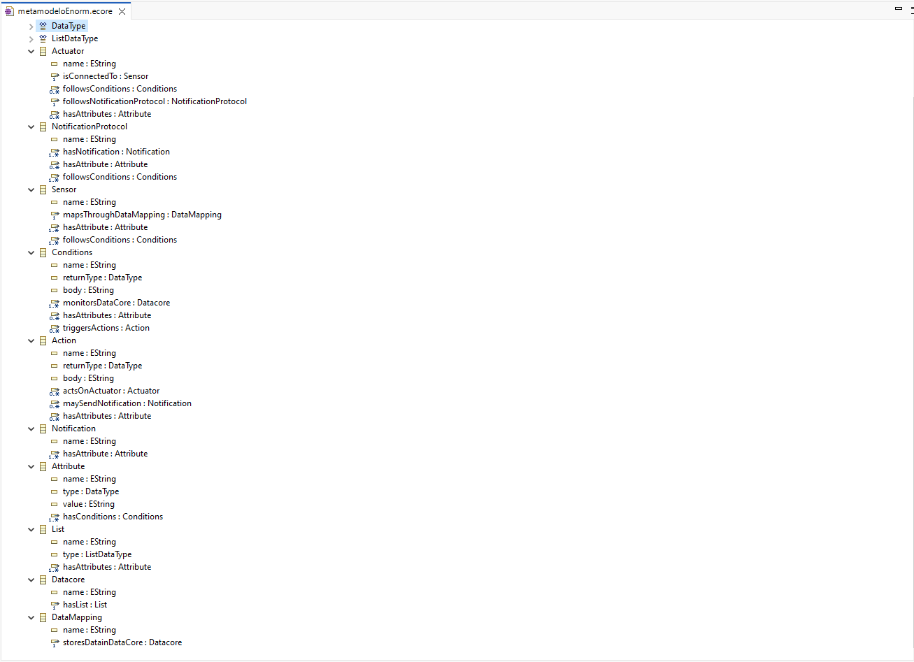

# ENORM Project, Part 1, Sirius Tool

In this folder you should add **all** artifacts developed for part 1 of the ENORM Project, related to the Sirius tool.

You should also include in this file the report for this part of the project (only for the Sirius tool).

**Note:** If for some reason you need to bypass these guidelines please ask for directions with your teacher and **always** state the exceptions in your commits and issues in GitHub.

Following there are examples of proposed sections for the report.

## Description of the Tool

Sirius is an Eclipse tool that allows the definition of customized graphical modeling environments for specific metamodels. The main goal of Sirius is to facilitate the creation of graphical modeling environments without requiring extensive coding, enabling the definition of diagrams, tables, and trees.

## How to Setup and Install

In order to install the Sirius Tool you first need to install  Eclipse IDE for Java and DSL Developers, with a version that includes the Eclipse Marketplace.
After opening, navigate to Help -> Eclipse Marketplace menu.
Search for Sirius, install the plugin and restart Eclipse to complete the installation.
After these steps, the Sirius tool should be ready to be used 

## Implementation of the Metamodel

To implement the metamodel using the Sirius tool, as outlined in the Project Assignment, we take advantage of the fact that Sirius is built on top of the Eclipse Modeling Framework (EMF). This allows us to design the metamodel using Ecore.

The first step was to create a new project, selecting Ecore Modeling Project as the base:

Next, the metamodel was designed within the .ecore file, following the structure defined in [metamodeloAtualizado.puml](..%2FmetamodeloAtualizado.puml). The image below shows the result:

The diagram includes all defined classes, their attributes, methods, and the relationships between them:

Here we can see all defined classes, their attributes, methods, and the relationships between them in an easier way.
Considering the relationships being so important and so many, I decided to name them as seen in the diagram below, to make it easier to understand the relationships between the classes.

## Implementation of Constraints and Refactorings

In order to implement the Constraints and Refactorings, we first needed to implement a basic/minimum graphical representation. To do that I implemented the Scenario 2 of the given problem, as seen on the image below

In this representation, we can see the WasteDeposit scenario described using our metamodel.

Due to various difficulties faced when trying to implement the constraints and refactors I ended up creating only 1 constraint and 1 refactor, which are described below.

It´s a simple validation that checks if the Scenario name has more than 3 characters, and if it does not, it shows an error message. There is also Refactoring that allows us to change the name of the Scenario, which is useful when we want to correct a mistake in the name.

## Implementation of the Visualizations

This section describes the implementation of graphical visualizations in the Sirius tool, which allows us to create graphical representations of our metamodel instances. The visualizations are designed to provide a clear and intuitive view of the relationships and attributes of the classes defined in our metamodel.
The rules were defined in the readme file of the project, and this section will detail the implementation of these visualizations in Sirius.

For the relationships I used the Relation Based Edges with simple lines, as shown in the image below.

## Implementation of Models (instances)

### Scenario 1 - 'Conveyor Belt'
- In this section, we present the implementation of a model instance based on the Conveyor Belt scenario. This model is created using the metamodel defined earlier and serves as an example of how to represent a specific scenario within our modeling environment.

### Scenario 2 - 'Waste Deposit'
- In this section, we present the implementation of a model instance based on the Waste Deposit scenario. This model is created using the metamodel defined earlier and serves as an example of how to represent a specific scenario within our modeling environment.

### Scenario 3 - 'Humidity Sensitive Area'
- In this section, we present the implementation of a model instance based on the Humidity Sensitive Area scenario. This model is created using the metamodel defined earlier and serves as an example of how to represent a specific scenario within our modeling environment.

## Execution of Constraints and Refactorings

In order to test the Constraints and Refactorings, based on the implementation of the model created in the previous section, we can execute the constraints and refactorings defined in our metamodel. This allows us to validate the model against the defined constraints and apply any necessary refactorings to ensure compliance with the metamodel rules.

In the viewpoint definition, we define a series of Validation Rules that will check each model instance against the constraints defined there. These rules are designed to ensure that the model adheres to the specified constraints and provides feedback when violations occur.

To execute the constraints, we can right-click on the model instance and select the "Validate Diagram" option. This will trigger the validation process, checking if the model adheres to the defined constraints. If any violations are found, they will be displayed in the Problems view.

In this case, in purpose I named the Actuator "A", which violates the constraint that requires the name to have more than 3 characters. The validation process will highlight this issue, allowing us to correct it.

To apply the refactoring (fix) we can Right-Click on the problem and choose "Quick Fix", which will allow us to change the name of the Actuator to something that complies with the constraint.

And then choose the correct QuickFix

In this case the name is corrected to "Scenario Teste".

## Generation/Execution of Visualizations

In this section we will describe how the plantuml visualizations were generated and executed based on the metamodels visualizations created in the previous section. This plantum files provide a different representation of the models, allowing for a better understanding of the relationships and attributes defined in the metamodel.

This was the file intended to generate the plantuml files, which was created as an External Java Action. It contains the necessary information to generate the visualizations based on the metamodel instances.

[GeneratePlantUML.java](Sirius%2FGeneratePlantUML%2FGeneratePlantUML.java)

On the .odesign we used a section in order to call the service that was created. 

To execute the function, we can right-click on the model instance and select the "Generate PlantUML" option. This will trigger the generation of the plantuml files based on the defined visualizations.

These were the generated plantuml files.

[scenario 1.plantuml](Images%2Fplantuml%2Fscenario%201.plantuml)

[scenario 2.plantuml](Images%2Fplantuml%2Fscenario%202.plantuml)

[scenario 3.plantuml](Images%2Fplantuml%2Fscenario%203.plantuml)