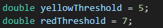
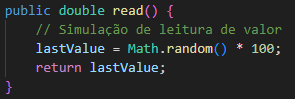
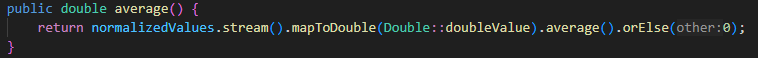
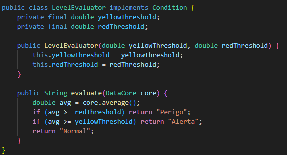
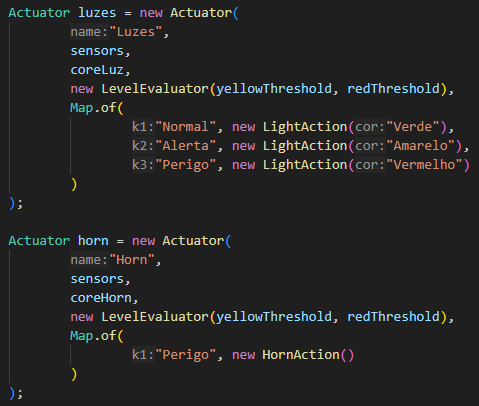
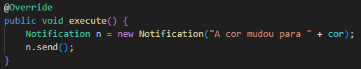
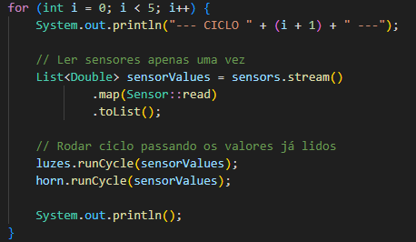
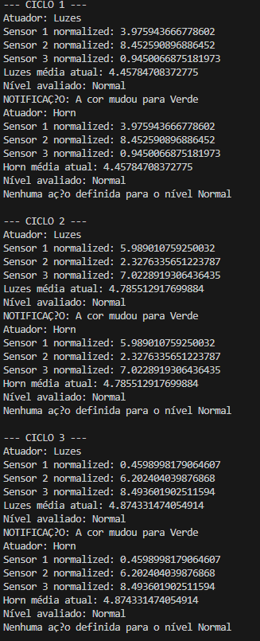

# ENORM Project, Part 2, Sirius Tool

In this folder you should add **all** artifacts developed for part 2 of the ENORM Project, related to Sirius tool.

You should also include in this file the report for this part of the project (only for Sirius tool).

**Note:** If for some reason you need to bypass these guidelines please ask for directions with your teacher and **always** state the exceptions in your commits and issues in GitHub.

## Design Concrete Syntax for the DSL

The concrete syntax for the DSL has been developed using the Sirius tool in Eclipse. This includes the definition of graphical representations for the main entities of the metamodel, such as Scenario, Actuator, Sensor, Condition, Action, and Notification.

Each graphical element is associated with its corresponding semantic class in the metamodel and supports model creation and editing operations through the Sirius-based editor.

### Graphical Syntax 

In order to represent the models graphically we will follow this rules, which were defined on the first project and will now be reused

- The Scenario will be represented by a white Dot
- The Actuator will be represented by a black Diamond
- The Sensor will be represented by blue Ellipse
- The DataMapping will be represented by brown Ellipse
- The DataCore will be represented by gray Square
- The List will be represented by green Ellipse
- The Attribute will be represented by orange Diamond
- The Conditions will be represented by purple Square
- The NotificationProtocol will be represented by red Square
- The Action will be represented by yellow Ellipse
- The Notification will be represented by white Square

These visual elements will be used in the Sirius graphical editor implementation, ensuring each type of element is visually distinguishable.

### Textual Syntax

We do not use a textual syntax within the Sirius tool for this DSL. All model manipulation and visualization are based on the graphical syntax defined using Sirius representations. Any textual expressions (e.g., conditions or logic in body attributes) are included as part of the graphical model using labels or attribute fields.

## Implement Prototypes of Applications of the Domain

To validate and demonstrate the usability of the DSL designed with Sirius, we developed example models (prototypes) that illustrate concrete use cases in the domain of Device-Oriented Software Services.

#### Developed Example

This prototype models a Waste Deposit scenario, where hazards are detected through sensor readings and appropriate responses are triggered via actuators. 

The implementation demonstrates how the metamodel architecture defined in the first project can be mapped into working Java code.

- The system monitors three shared sensors that continuously read values representing values in a raw state. These values are normalized via a condition, averaged, and classified into levels, via thresholds, which are then used to activate actuators:

  - Normal: Green light, that activates the green light;

  - Alert: Yellow light, that activates the yellow light;

  - Danger: Red light + horn, that activates the red light and the activates horn.

  - The thresholds for these levels are currently hardcoded in the code, but they can be easily modified to adapt to different scenarios.

  

- The primary goal is to detect hazard levels from raw sensor data, normalize the values throw a condition, and activate actuators (light and horn) based on those values.

- System Structure and Behavior
  - Sensor Readings and Normalization
    - Each Sensor generates a random value between 0–100:

    

    - This value is normalized, which is a simple division by 10, to fit into a range of 0–10:

- Data Collection and Evaluation
  - Normalized values are stored in a DataCore, which computes the average:

  
  
  - This average is passed to the LevelEvaluator, that implements a Condition and deines logic for the thresholds:

  

- Actions and Actuators
  - Each Actuator has a Condition (on the metamodel implementation it was design to have 3 conditions, one for each level, but for easier implementation the level was all managed in 1 condition) that can activate an Action based on the evaluated level:
  
  
  

  - Each Action can send a Notification, which is a simple message that can be logged or displayed:
  
  

  - Execution Flow:
    - The Main method runs 5 cycles, simulating real-time monitoring:
    
    

    - Each cycle:

    - Reads sensor values,

    - Normalizes and stores them,

    - Computes average,

    - Evaluates level,

    - Executes actions (lights + horn) based on level.

  - Example Output:

  

#### Issues Found

- Some relationships and elements defined in the UML metamodel were not fully represented in the implementation.
  - For instance, NotificationProtocol, DataMapping, and List are present in the metamodel but were not implemented in the code. This was mainly due to the complexity of implementing these elements in a way that would be useful for this simple prototype.
- While the UML defines a flexible and generic Attribute class that can be attached to several entities (e.g., Actuator, Sensor, Notification), this concept was not implemented in the code.
  - The code makes use of specific attributes for each entity, which makes it less flexible and reusable, but easier to understand and implement for this prototype.
  - This is a trade-off between flexibility and simplicity, and it was made to keep the implementation straightforward and faster for the prototype.
- Notification Logic Is Simplified
  - In this code there is only a message notification type, which is a simple hard coded message with possible varying colors.
- Normalization and Average should be treated as a Condition
  - In this case I didn't do such thing as it was adding complexity to a simple raw/10 or a calculation of an average of a list, but it could be easily implemented in the future to make the code more flexible and reusable by simply creating a condition based on the interface.
- Even with these limitations, the prototype demonstrates the core functionality of the metamodel and how it can be used to build a reactive system that responds to sensor data in real-time.
  - Since the Action and Conditions are designed as interfaces, they can be easily extended to add new behaviors or functionalities in the future, even though in the current its only on the LightAction/HornAction and LevelEvaluator. 

#### Summary 

This implementation proves the viability of the metamodel, showing how abstract components like Condition, Action can be used to build a reactive and extensible system for environments such as waste deposits. 

All logic is clearly separated, reusable, and easily extendable for new scenarios or behaviors.

## Design and Implement Code Generation

The code generation process aims to automatically transform models created using the DSL into executable code, thus bridging the gap between high-level domain modeling and low-level implementation. 
For this project, unlike the first where I used external java code, I used Acceleo as the primary tool to implement model-to-text (M2T) transformations based on the models defined with the Sirius graphical editor.

The main goal is to automate the generation of code skeletons and domain-specific logic from the elements designed in the model (e.g., Scenarios, Sensors, Actuators, Conditions, and Actions). 
The output of this transformation is a set of Java classes that reflect the behavior and structure defined in the graphical model.

### Design the Templates/Rules

- The templates were designed using the Acceleo language and are structured to reflect the semantics of each key entity in the metamodel.

  - Each Scenario generates a corresponding Java class that acts as the main execution environment (e.g., with a main loop).

  - Sensors and Actuators generate interfaces and implementations that simulate reading values and executing actions.

  - Conditions are generated as classes implementing a generic Condition interface with logic placeholders.

  - Actions generate classes that encapsulate the execution logic, including optional notification behaviors.

  - Notifications produce methods that log or display messages based on the triggered action.

- The transformation rules follow a modular approach, where each metamodel class has a corresponding template responsible for generating code fragments. These fragments are composed and assembled in the main scenario template.

### Common Parts Specification

- The common parts of the generated code include:

  - Interfaces: Generic interfaces for Sensor, Actuator, Action, and Condition are always generated. These define a contract that all implementations must follow.

  - Utility Classes: A shared DataCore class that handles sensor value storage.

  - Enums and Constants: Threshold levels, color definitions, and identifiers are predefined and reused across templates.

  - Notification Mechanism: A simple utility class is included to display messages or simulate alerts.

  - Main Execution Class: Each generated scenario includes a main class that orchestrates the execution flow, reading sensor values, evaluating conditions, and executing actions.

- These components are not specific to any one model but are instead reused across all generated applications to ensure consistency.

### Variable Parts Specification

- The variable parts are tailored to each model instance and reflect the unique configuration of that particular scenario:

  - Scenario-specific logic: Each model produces a Main class tailored to its defined sensors, actuators, and behavior.
  - Condition logic: Placeholder methods are generated with predefined structure, allowing the developer to insert custom logic.
  - Action behavior: For each action defined in the model, a corresponding Java class is generated with a method to perform its logic.
  - Actuator implementations: Depending on the model, different actuators (e.g., lights, horn) are generated with specific activate() logic.

- These parts vary from one model to another and reflect the logic encoded in the graphical representations within Sirius. 

### Folder Structure and Execution Instructions
The code generation component was developed by creating a new Acceleo Project on the runtime. 

The metamodel devoleped in the first part of the project was imported into the Acceleo project, and the templates were created to generate code based on the metamodel.

Then the templates are placed in the tasks/generate.mtl file, which is the main entry point for the code generation process.

However, due to the lack of time this is not totally finished, and the code generation is not fully functional yet.
The generated code is expected to be placed in the src folder of the Acceleo project, and it can be executed by running the main method of the generated scenario class.

## Generate Applications

At this stage of the project, the automatic generation of applications from the developed models was unable to be finished. The goal was to enable executable code to be generated directly from the graphical models created with the Sirius tool, reflecting each scenario's specific requirements and behaviors.

However, due to the lack of not only time but also some issues with the Acceleo code generation process, the full implementation of this feature was not completed.

Although full application generation is not yet complete, the developed prototypes demonstrate the potential of this approach and validate the viability of the metamodel and transformations. If given more time, code generation would be expected to speed up development, reduce errors, and ensure consistency between models and implementations.

### Scenario 1

You might add some text here.

### Scenario 2

You might add some text here.

### Scenario 3

You might add some text here.